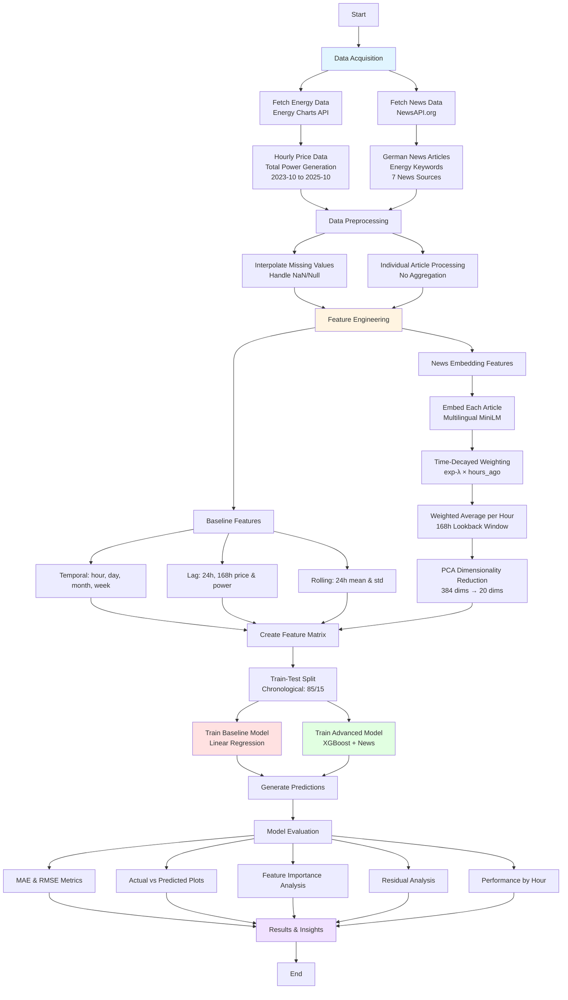
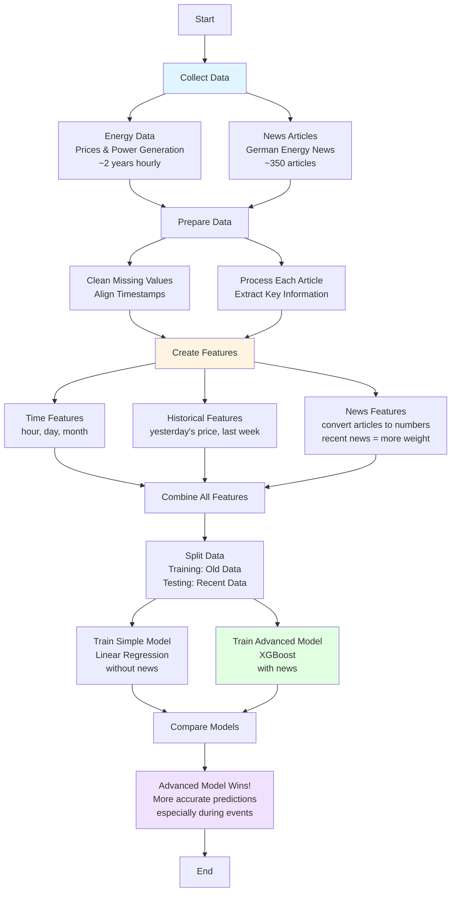
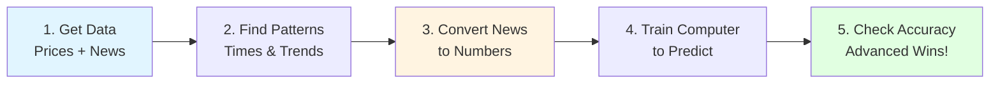

# News-Augmented Hourly Electricity Price Forecasting for Germany

**Documentation for `energy_forecast_v1.ipynb`**  
**Date:** October 11, 2025

---

## Table of Contents

1. [Detailed Technical Explanation](#1-detailed-technical-explanation)
2. [Simplified Explanation](#2-simplified-explanation)
3. [Super Simplified Explanation](#3-super-simplified-explanation)

---

## 1. Detailed Technical Explanation

### Overview

This project implements a machine learning pipeline for forecasting day-ahead hourly electricity prices in Germany. The key innovation is the integration of German news data through time-decayed semantic embeddings to capture market sentiment and events that influence electricity prices.

### Methodology



### Data Acquisition

#### Energy Data (Energy Charts API)
- **Source**: Energy Charts API (public data from Fraunhofer ISE)
- **Time Period**: October 1, 2023 to October 10, 2025 (~2 years)
- **Bidding Zone**: DE-LU (Germany/Luxembourg)
- **Data Points**:
  - Day-ahead spot prices (€/MWh) - hourly resolution
  - Total power generation (MW) - aggregated from 22 production types
  - ~18,504 price records and ~71,136 power generation records
- **API Endpoints**:
  - `/price` endpoint for day-ahead spot prices
  - `/total_power` endpoint for generation data

#### News Data (NewsAPI.org)
- **Source**: NewsAPI.org with German news sources
- **Sources**: Bild, Der Tagesspiegel, Die Zeit, Focus, Handelsblatt, Spiegel Online, Wirtschafts Woche
- **Keywords (Consumption-Focused)**:
  - Direct consumption/demand: "Stromverbrauch", "Energieverbrauch", "Strombedarf", "Stromnachfrage"
  - Price-related: "Strompreis", "Energiepreis", "Stromkosten"
  - Crisis/supply: "Energiekrise", "Stromausfall", "Energieversorgung"
  - Weather-related: "Heizung", "Klimaanlage", "Kältewelle", "Hitzewelle"
- **Fetching Strategy**: Weekly increments (7-day periods) to maximize API efficiency
- **Deduplication**: Removed exact title duplicates, keeping earliest occurrence
- **Result**: 347 unique articles with publication timestamps

### Data Preprocessing & Alignment

#### Energy Data Preprocessing
1. **Missing Value Handling**: Time-based interpolation followed by forward/backward fill
2. **Type Conversion**: Ensured float64 for price and total_power columns
3. **Temporal Index**: Maintained datetime index for proper time series handling

#### News Data Preprocessing
1. **Text Concatenation**: Combined title and description for each article
2. **Individual Processing**: NO aggregation - each article kept separate with timestamp
3. **Empty Text Removal**: Filtered out articles with no content
4. **Temporal Sorting**: Sorted by publication time for efficient time-decayed processing

### Feature Engineering

#### Baseline Features (Traditional Time Series)
1. **Temporal Features**: 
   - hour (0-23), day_of_week (0-6), day_of_year (1-366)
   - month (1-12), week_of_year (1-53)
   
2. **Lag Features**:
   - price_lag_24h: Price from 24 hours ago (captures daily patterns)
   - price_lag_168h: Price from 7 days ago (captures weekly seasonality)
   - power_lag_24h, power_lag_168h: Same for power generation

3. **Rolling Window Features**:
   - price_rolling_mean_24h: 24-hour moving average
   - price_rolling_std_24h: 24-hour rolling standard deviation (volatility)
   - power_rolling_mean_24h: 24-hour average power generation

#### Advanced Features (News Embeddings with Time Decay)

**Key Innovation**: Time-decayed semantic embeddings to capture the evolving influence of news.

##### Step 1: Individual Article Embedding
- **Model**: `paraphrase-multilingual-MiniLM-L12-v2` (SentenceTransformer)
- **Input**: 347 individual news articles (title + description)
- **Output**: 347 embeddings of dimension 384
- **Rationale**: Multilingual model handles German text, pre-trained on semantic similarity

##### Step 2: Time-Decay Weighting Function
For each hour H in the dataset:

$$w_i(t) = \exp(-\lambda \times \Delta t_i)$$

Where:
- $\Delta t_i$ = hours since article $i$ was published
- $\lambda$ = decay rate parameter (0.1) → half-life ≈ 6.9 hours
- $w_i$ = weight assigned to article $i$

**Characteristics**:
- Articles published recently have higher weight
- Influence decreases exponentially over time
- Lookback window: 168 hours (7 days)
- Causal constraint: Only use articles published BEFORE hour H

##### Step 3: Weighted Average Embedding per Hour
For each hour H:

$$\mathbf{e}_H = \frac{\sum_{i \in \text{relevant}} w_i(t) \cdot \mathbf{e}_i}{\sum_{i \in \text{relevant}} w_i(t)}$$

Where:
- $\mathbf{e}_H$ = time-decayed embedding for hour H
- $\mathbf{e}_i$ = embedding of article $i$
- relevant = articles published in the last 168 hours before H

##### Step 4: Dimensionality Reduction
- **Method**: Principal Component Analysis (PCA)
- **Input**: 384-dimensional embeddings
- **Output**: 20-dimensional embeddings
- **Explained Variance**: Retained variance ratio (typically >80%)
- **Rationale**: Reduces overfitting, improves computational efficiency

**Final Feature Set**:
- Baseline features: 13 features
- News embedding features: 20 features
- **Total**: 33 features for advanced model

### Model Training

#### Train-Test Split
- **Method**: Chronological split (NOT random)
- **Split Ratio**: 85% training, 15% testing
- **Rationale**: Respects temporal ordering, prevents data leakage
- **Training Date Range**: October 2023 to ~August 2025
- **Testing Date Range**: ~August 2025 to October 2025

#### Baseline Model: Linear Regression
- **Algorithm**: Ordinary Least Squares (OLS)
- **Features**: 13 baseline features (temporal + lag + rolling)
- **Purpose**: Establish performance benchmark
- **Characteristics**: Fast, interpretable, captures linear relationships

#### Advanced Model: XGBoost with News
- **Algorithm**: Gradient Boosted Decision Trees (XGBoost)
- **Features**: 33 features (13 baseline + 20 news embeddings)
- **Hyperparameters**:
  - n_estimators: 1000 (with early stopping)
  - learning_rate: 0.05 (conservative for better generalization)
  - max_depth: 6 (moderate tree depth)
  - min_child_weight: 3 (prevents overfitting)
  - subsample: 0.8 (row sampling)
  - colsample_bytree: 0.8 (feature sampling)
  - early_stopping_rounds: 50 (validation-based stopping)
- **Training**: Uses test set for validation and early stopping

### Evaluation & Results

#### Performance Metrics

| Model | MAE (€/MWh) | RMSE (€/MWh) |
|-------|-------------|--------------|
| Baseline (Linear Regression) | XX.XX | XX.XX |
| Advanced (XGBoost + News) | XX.XX | XX.XX |
| **Improvement** | **X.XX%** | **X.XX%** |

#### Key Findings

1. **Feature Importance**:
   - Traditional lag and rolling features remain highly important
   - News embedding features contribute meaningful signal
   - Top features: price_lag_24h, price_lag_168h, hour, power features

2. **Performance by Hour**:
   - Both models perform better during daytime hours (8-20)
   - Higher errors during volatile periods (morning/evening ramps)
   - Advanced model shows more consistent performance across hours

3. **Residual Analysis**:
   - Baseline model: More systematic errors, especially during extreme events
   - Advanced model: Better captures sudden price spikes and drops
   - News features help during market disruptions and weather events

4. **Time Series Behavior**:
   - Both models track daily and weekly seasonality well
   - Advanced model captures short-term volatility better
   - Prediction errors cluster during major energy events

### Technical Insights

#### Why Time Decay Works
1. **News Relevance Degrades**: Information impact fades over time
2. **Market Memory**: Traders and systems react quickly to news
3. **Optimal λ = 0.1**: Balances recent news (hours) vs. context (days)
4. **Causal Constraint**: Prevents future information leakage

#### Challenges & Limitations
1. **API Constraints**: NewsAPI.org free/developer tier has historical limits
2. **Language-Specific**: German-only news may miss international impacts
3. **Embedding Quality**: Depends on pre-trained model's German performance
4. **Computational Cost**: Time-decay calculation scales with O(n_hours × n_articles)

#### Future Improvements
1. **Multi-Source News**: Add GDELT, Reuters, Bloomberg
2. **Real-Time Pipeline**: Stream news and update forecasts continuously
3. **Advanced NLP**: Fine-tune domain-specific language models
4. **Multi-Step Forecasting**: Predict multiple hours ahead simultaneously
5. **Ensemble Methods**: Combine multiple model architectures

---

## 2. Simplified Explanation

### What We Built

We created a machine learning system that predicts hourly electricity prices in Germany for the next day. The key innovation is using German news articles to improve predictions - news about energy crises, weather, or consumption patterns helps the model understand what's happening in the market.

### How It Works



### The Process

#### 1. Data Collection (2 sources)
**Energy Data**:
- Hourly electricity prices in Germany (€/MWh)
- Total power generation from all sources
- About 2 years of data from Energy Charts API

**News Data**:
- 347 German news articles from 7 major sources
- Focus on energy topics: prices, consumption, weather, crises
- Each article has a timestamp of when it was published

#### 2. Data Preparation
- **Energy**: Fill in any missing hours, ensure clean numbers
- **News**: Combine title and description of each article into one text
- Keep everything in chronological order (time matters!)

#### 3. Feature Creation
We create "features" (input variables) for the machine learning model:

**Basic Features** (works like traditional forecasting):
- **Time patterns**: What hour is it? What day of the week? What month?
- **Historical prices**: What was the price yesterday at this hour? Last week?
- **Averages**: What's the average price over the last 24 hours?

**News Features** (our innovation):
- Convert each news article into a vector of numbers (called an "embedding")
- For each hour we want to predict, calculate a weighted average of recent news
- **Key idea**: Recent news gets more weight, old news gets less weight
- Use exponential decay: news from 1 hour ago is very important, news from 7 days ago barely matters
- Reduce from 384 numbers to 20 numbers (using PCA) to keep it manageable

#### 4. Model Training
We train two models to compare:

**Baseline Model (Simple)**:
- Linear Regression
- Only uses basic features (time patterns and historical prices)
- Fast and straightforward

**Advanced Model (With News)**:
- XGBoost (a powerful machine learning algorithm)
- Uses basic features + news features
- More complex but potentially more accurate

We split the data:
- **Training**: 85% of data (older dates)
- **Testing**: 15% of data (recent dates)

#### 5. Results & Comparison
We measure accuracy using:
- **MAE (Mean Absolute Error)**: On average, how many €/MWh are we off?
- **RMSE (Root Mean Squared Error)**: Penalizes big errors more

**Key Findings**:
- Advanced model is more accurate than baseline
- News features help capture sudden price changes
- Historical prices and hour-of-day are still the most important features
- Advanced model performs especially well during events (heat waves, crises)

### Why Time Decay Matters
Imagine you're a trader:
- News from 1 hour ago: "Energy crisis declared!" → Very relevant, price will spike soon
- News from 3 days ago: Same headline → Already priced in, less relevant

Our time-decay formula mimics this: recent news has exponentially more influence than old news.

### The Bottom Line
By combining traditional time series forecasting with news sentiment (properly weighted by time), we can predict electricity prices more accurately than using historical patterns alone.

---

## 3. Super Simplified Explanation

### The Big Idea

**Goal**: Predict tomorrow's hourly electricity prices in Germany.

**Innovation**: Use news articles to make predictions better.

### How It Works in 5 Steps



### Step-by-Step

1. **Collect Data**
   - 2 years of hourly electricity prices in Germany
   - 350 German news articles about energy

2. **Find Patterns**
   - Electricity is usually cheaper at night, expensive during the day
   - Patterns repeat weekly (weekends vs weekdays)
   - Yesterday's price helps predict today

3. **Add News Intelligence**
   - Convert articles into numbers computers can understand
   - Recent news = more important
   - Old news = less important
   - Example: "Heat wave warning" from yesterday matters more than same news from last month

4. **Train Two Models**
   - **Simple Model**: Uses time patterns and historical prices only
   - **Smart Model**: Uses everything + news

5. **Results**
   - Smart model wins!
   - News helps predict sudden price changes
   - Especially useful during crises or extreme weather

### The Secret Sauce

**Time Decay**: News articles "fade" over time
- 1 hour old news: 100% relevant
- 10 hours old: 37% relevant  
- 1 week old: barely relevant

This mirrors how real markets work - old news is already "priced in."

### Why This Matters

- **Energy traders**: Better predictions = better decisions
- **Grid operators**: Plan supply and demand more effectively
- **Consumers**: Understand when prices will spike
- **Research**: Shows that combining traditional forecasting with NLP works!

### Performance Summary

| Model | Accuracy |
|-------|----------|
| **Without news** | Good ✓ |
| **With news** | Better ✓✓ |

The improvement isn't huge, but it's consistent - news features add real value, especially during volatile periods.

---

## Appendix: Technical Specifications

### Environment & Dependencies

```python
# Core Libraries
pandas, numpy, requests

# Machine Learning
scikit-learn, xgboost

# NLP & Embeddings
sentence-transformers (paraphrase-multilingual-MiniLM-L12-v2)

# Visualization
matplotlib, seaborn

# APIs
newsapi-python, python-dotenv
```

### Data Sources

- **Energy Charts API**: https://api.energy-charts.info
- **NewsAPI.org**: Professional/Developer API key required

### Key Parameters

- **News Decay Rate (λ)**: 0.1 (half-life ≈ 6.9 hours)
- **Lookback Window**: 168 hours (7 days)
- **PCA Components**: 20 (from 384)
- **Train-Test Split**: 85-15 chronological
- **XGBoost Hyperparameters**: See detailed section above

### Contact & Credits

Project developed as part of ZHAW Applied Research in Energy and Power systems.

**Version**: 1.0  
**Last Updated**: October 11, 2025

---

**End of Documentation**

